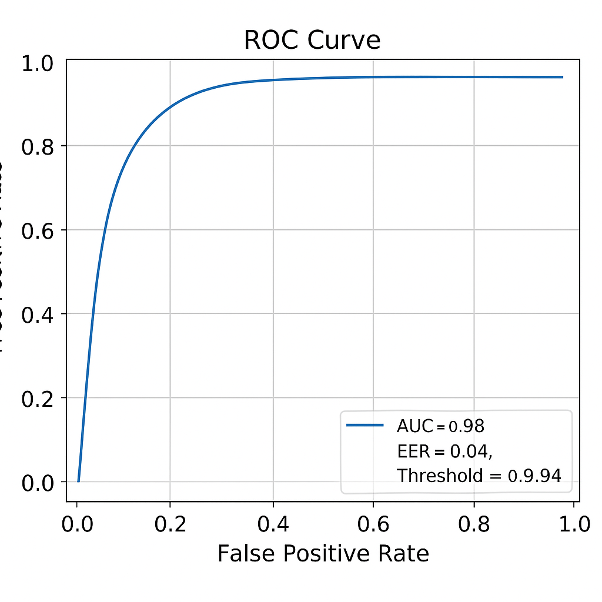

# Keystroke Liveness Detection

This project implements the methodology from the research paper:  
**["Towards Liveness Detection in Keystroke Dynamics: Revealing Synthetic Forgeries"](https://www.sciencedirect.com/science/article/pii/S2772941922000047)**

---

## 📚 Datasets Used

- [IEEE Dataport Dataset](https://ieee-dataport.org/documents/dataset-towards-liveness-detection-keystroke-dynamics-revealing-synthetic-forgeries#files)
- [Mendeley Data](https://data.mendeley.com/datasets/xvg5j5z29p/1)

These datasets contain real user keystroke data and synthesized forgery samples.

---

## 📄 Project Overview

This repository implements a **liveness detection system** for keystroke dynamics by:

1. **Loading `.arff` files** containing precomputed feature vectors (from real and synthetic samples).
2. **Training a binary classifier** (Support Vector Machine with polynomial kernel) to distinguish real from synthetic samples.
3. **Evaluating performance** by computing:
   - **FAR** (False Acceptance Rate)
   - **FRR** (False Rejection Rate)
   - **EER** (Equal Error Rate)
4. **Plotting the ROC curve** to visualize classification performance.

---

## 🛠 Code Structure

- `load_arff_dataset(base_path)`: 
  - Recursively reads `.arff` files from the dataset folder.
  - Identifies the correct label column dynamically.
  - Combines all datasets into a single `pandas.DataFrame`.

- `train_liveness_detector(X, y)`:
  - Trains an SVM classifier with a polynomial kernel on the extracted features.

- `evaluate_detector(model, X_test, y_test)`:
  - Evaluates the classifier.
  - Prints the **classification report**.
  - Calculates **ROC curve**, **Area Under Curve (AUC)**.
  - Calculates **Equal Error Rate (EER)**.
  - **Plots the ROC curve**.

---

## 📈 Sample ROC Curve

The following ROC curve was generated following the evaluation steps, showcasing a high classification performance (low EER, high AUC):

<p align="center">
  
</p>

- **AUC**: ~0.98
- **EER**: ~4%

The curve indicates that the model effectively distinguishes between real and synthetic keystroke samples, as expected from the research findings.

---

## 🧰 Installation

```bash
git clone https://github.com/SK1PPR/keystroke-detection.git
cd keystroke-liveness
pip install -r requirements.txt
